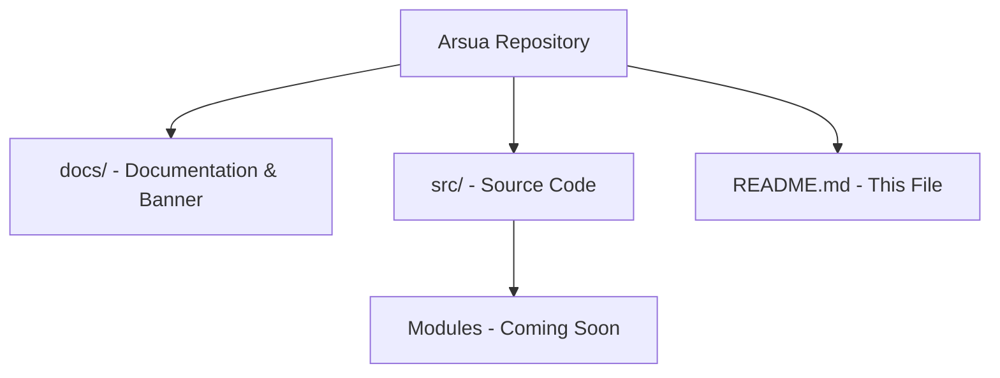

<p align="center">
  
</p>

> **Developed by [Arslan Malik](https://github.com/arsalanmaalik461)**
> 📱 WhatsApp: [+92 300 8987448](https://wa.me/923008987448) · 🌐 Website: [arslanmalik.tech](https://arslanmalik.tech)

---

## 🌟 Executive Overview

**Arsua** is a fresh project repository created and maintained by Arslan Malik. It is currently a clean slate — the first code, documentation, and assets for the project are being prepared, and this README serves as the starting point for everything that will live here.

The repository follows standard open-project conventions: a clear folder layout, a documented setup path, and consistent branding from day one. As features, modules, and tooling land, this document will grow with them — architecture diagrams, feature tables, and installation guides will be updated to match the actual implementation.

---

## 📑 Table of Contents

- [✨ Key Features & Highlights](#-key-features--highlights)
- [🖥️ Feature Showcase](#️-feature-showcase)
- [🏗️ System Architecture](#️-system-architecture)
- [🚀 Quickstart & Installation Guide](#-quickstart--installation-guide)
- [📂 Project Structure](#-project-structure)
- [🛡️ Security & Notes](#️-security--notes)

---

## ✨ Key Features & Highlights

| Feature | Description |
| :--- | :--- |
| 🌱 Fresh Repository | Clean, newly initialized project — ready to build on |
| 📝 Living Documentation | This README evolves with the codebase as it grows |
| 🎨 Consistent Branding | Project banner and developer branding in place from day one |
| 🛠️ Standard Workflow | Git-based workflow, clear structure, documented setup |

---

## 🖥️ Feature Showcase

### 1. Project Foundation

> A solid starting point — branding, structure, and docs before the first feature.

- Branded banner under `docs/assets/`
- Template-ready README covering features, architecture, and setup
- Placeholder structure for source code and docs

### 2. Ready to Build

> Everything is staged so new modules can be added with zero setup friction.

- Add source code under a `src/` directory
- Add docs under `docs/`
- Update the sections below (features, architecture, quickstart) as the project takes shape

---

## 🏗️ System Architecture



---

## 🚀 Quickstart & Installation Guide

### Prerequisites

- [Git](https://git-scm.com/) installed
- A terminal / shell
- (Project-specific runtimes and dependencies will be listed here once the stack is chosen)

### Step-by-Step Installation

```bash
# Clone the repository
git clone https://github.com/arsalanmaalik461/arsua.git
cd arsua

# Project code lands here as it is developed
# Check back for stack-specific install and run instructions
```

---

## 📂 Project Structure

```
arsua/
├── docs/
│   └── assets/
│       └── banner.svg      # Project banner
├── README.md               # Project documentation
└── (src/ etc. — coming soon)
```

---

## 🛡️ Security & Notes

- This is a newly initialized repository; no secrets, credentials, or tokens should be committed at any point.
- Use a `.gitignore` appropriate for the chosen stack before adding code.
- Keep dependency lists and setup instructions in sync with this README as the project grows.

---

<p align="center">
  <sub>Developed with ❤️ by <a href="https://github.com/arsalanmaalik461">Arslan Malik</a> · 📱 <a href="https://wa.me/923008987448">WhatsApp: +92 300 8987448</a> · 🌐 <a href="https://arslanmalik.tech">arslanmalik.tech</a></sub>
</p>
